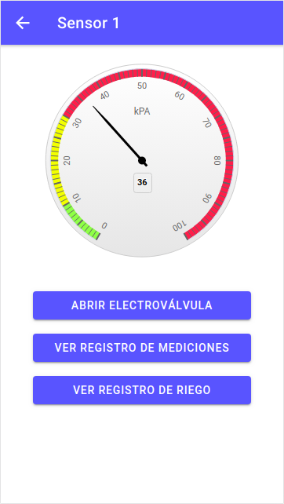

# Trabajo Práctico Final

## Desarrollo de aplicaciones multiplataforma

## 4ta Cohorte 2021

Autor

* Pablo C. Zizzutti

Docente 

* Brian Ducca


## Introducción general

El Final de la materia Desarrollo de Aplicaciones Multiplataforma (DAM) consiste en el diseño e implementación de una aplicación para el control de un sistema de riego automatizado. Se aplicaron conceptos vistos durante la cursada de la materia implementando los mismos en el diseño de una aplicacion con el framework Angular para el diseño de la pagina web conjuntamente al framework Ionic para darle una adaptabilidad a los dispositivos móviles.

## Instalación de dependencias

Para el funcionamiento del backend se utilizó el mismo contenedor de Docker utilizado en la materia Desarrollo de Aplicaciones Web.
Para el correcto funcionamiento del frontend se requiere tener instalado el framework Ionic. Para la instalación de Ionic se utiliza el comando :

```
npm install -g @ionic/cli
```

Adicionalmente se requiere instalar la biblioteca highcharts para la visualización de los gráficos con el comando:

```
npm install highcharts --save
```

Para poder visualizar la vista **Lab** pudiendo testear la compatibilidad visual con dispositivos Android y IOS simultaneamente se requiere instalar:

```
npm i @ionic/lab
```

Luego se podrá acceder con un browser a dos url segun la vista que deseemos ver:

    Lab: http://localhost:8200
    Local: http://localhost:8100

## Implementación

### Introducción específica

La aplicación se comunica con el servidor web utilizando solicitudes HTTP el cual utiliza Node.js para el intercambio de datos y la visualización de la información de los dispositivos almacenados en la base de datos.

Para el diseño del frontend se utilizó framework Ionic conjunto al framework Angular. 

Para el desarrollo del backend se utilizó Express.js el cual es un framework de Node.js gratuito y open source. A su vez, se implementó una base de datos MySQL junto con el gestor phpMyAdmin.

### Desarrollo del backend

El backend conformado dentro de una imagen de docker consta de :

* Una base de datos MySQL
* Una imagen de Node.js con Express
* Un gestor de base de datos phpMyAdmin
### Desarrollo del frontend

Según lo indicado en la consigna del Trabajo Final se implementaron las siguientes funcionalidades:

#### Listado de dispositivos

La aplicación realiza un listado completo de los dispositivos al iniciarse.

#### Información de cada dispositivo

Al hacer click en algun dispositivo se visualiza con un gauge el valor de la medición conjuntamente a opciones para la modificación del elemento.

<p align="center">
  
</p>

#### Apertura y cierre de electroválvula

Al hacer click en cada electroválvula, dependiendo del último estado de la misma se abrirá o cerrará. Se pueden mencionar dos situaciones:

> Si la válvula esta abierta se cerrará y se generará un log en las tablas Log_Riegos y Mediciones.

> Si la válvula esta cerrada solamente se generará un log en las tabla Log_Riegos.

#### Visualización de registro de mediciones

Al seleccionar la opción Ver registro de mediciones se visualizará una tabla con todo el historial de mediciones asociadas a dicho sensor en particular.

#### Registro de riegos

Al seleccionar la opción Ver registro de riego se visualizará una tabla con todo el historial de riegos asociados a dicho sensor en particular.

## Ejecución de la aplicación

### Inicialización del backend

Una vez instaladas todas las dependencias necesarias se podrá ejecutar el siguiente comando para levantar el docker :

```
docker-compose up
```
### Inicialización del frontend

Dentro del directorio del frontend ejecutaremos el siguiente comando:

```
ionic serve --lab
```

Luego se podrá acceder con un browser a dos url segun la vista que deseemos ver:

* Lab: http://localhost:8200

* Local: http://localhost:8100
